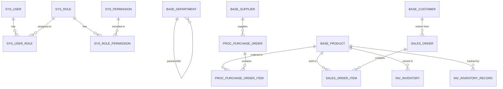

# ERP 系统数据库 ER 图设计文档

## 1. 概述

本文档描述 ERP 系统的数据库实体关系设计，基于 MySQL 8.0+ 数据库。

## 2. 数据库设计原则

- 使用 UUID 作为主键（VARCHAR(36)），保证分布式环境下的唯一性
- 所有表包含 `created_at` 和 `updated_at` 时间戳字段（自动更新）
- 使用外键约束保证数据完整性
- 适当创建索引优化查询性能
- 采用软删除策略（enabled 字段）而非物理删除
- 使用 InnoDB 引擎，utf8mb4 字符集

## 3. 实体关系图 (ER Diagram)



## 4. 数据表详细设计

### 4.1 系统管理模块

#### sys_user (用户表)

| 字段名 | 类型 | 约束 | 说明 |
|--------|------|------|------|
| id | UUID | PK | 用户 ID |
| username | VARCHAR(50) | UNIQUE, NOT NULL | 用户名 |
| password | VARCHAR(100) | NOT NULL | 密码 (bcrypt 加密) |
| email | VARCHAR(100) | NOT NULL | 邮箱 |
| phone | VARCHAR(20) | | 手机号 |
| real_name | VARCHAR(50) | | 真实姓名 |
| enabled | BOOLEAN | DEFAULT true | 是否启用 |
| created_at | TIMESTAMP | DEFAULT CURRENT_TIMESTAMP | 创建时间 |
| updated_at | TIMESTAMP | DEFAULT CURRENT_TIMESTAMP | 更新时间 |

#### sys_role (角色表)

| 字段名 | 类型 | 约束 | 说明 |
|--------|------|------|------|
| id | UUID | PK | 角色 ID |
| code | VARCHAR(50) | UNIQUE, NOT NULL | 角色编码 |
| name | VARCHAR(100) | NOT NULL | 角色名称 |
| description | TEXT | | 描述 |
| created_at | TIMESTAMP | DEFAULT CURRENT_TIMESTAMP | 创建时间 |
| updated_at | TIMESTAMP | DEFAULT CURRENT_TIMESTAMP | 更新时间 |

#### sys_permission (权限表)

| 字段名 | 类型 | 约束 | 说明 |
|--------|------|------|------|
| id | UUID | PK | 权限 ID |
| code | VARCHAR(100) | UNIQUE, NOT NULL | 权限编码 |
| name | VARCHAR(100) | NOT NULL | 权限名称 |
| type | VARCHAR(50) | | 类型 (menu/button/api) |
| path | VARCHAR(200) | | 路径 |
| enabled | BOOLEAN | DEFAULT true | 是否启用 |
| created_at | TIMESTAMP | DEFAULT CURRENT_TIMESTAMP | 创建时间 |
| updated_at | TIMESTAMP | DEFAULT CURRENT_TIMESTAMP | 更新时间 |

#### sys_user_role (用户角色关联表)

| 字段名 | 类型 | 约束 | 说明 |
|--------|------|------|------|
| user_id | UUID | PK, FK | 用户 ID |
| role_id | UUID | PK, FK | 角色 ID |

#### sys_role_permission (角色权限关联表)

| 字段名 | 类型 | 约束 | 说明 |
|--------|------|------|------|
| role_id | UUID | PK, FK | 角色 ID |
| permission_id | UUID | PK, FK | 权限 ID |

### 4.2 基础数据模块

#### base_department (部门表)

| 字段名 | 类型 | 约束 | 说明 |
|--------|------|------|------|
| id | UUID | PK | 部门 ID |
| code | VARCHAR(50) | NOT NULL | 部门编码 |
| name | VARCHAR(100) | NOT NULL | 部门名称 |
| description | VARCHAR(500) | | 描述 |
| parent_id | UUID | FK | 父部门 ID |
| enabled | BOOLEAN | DEFAULT true | 是否启用 |
| created_at | TIMESTAMP | DEFAULT CURRENT_TIMESTAMP | 创建时间 |
| updated_at | TIMESTAMP | DEFAULT CURRENT_TIMESTAMP | 更新时间 |

#### base_supplier (供应商表)

| 字段名 | 类型 | 约束 | 说明 |
|--------|------|------|------|
| id | UUID | PK | 供应商 ID |
| code | VARCHAR(50) | UNIQUE, NOT NULL | 供应商编码 |
| name | VARCHAR(200) | NOT NULL | 供应商名称 |
| type | VARCHAR(50) | | 类型 |
| contact_person | VARCHAR(100) | | 联系人 |
| phone | VARCHAR(20) | | 联系电话 |
| email | VARCHAR(100) | | 邮箱 |
| address | VARCHAR(500) | | 地址 |
| bank_info | TEXT | | 银行信息 |
| tax_id | VARCHAR(50) | | 税号 |
| enabled | BOOLEAN | DEFAULT true | 是否启用 |
| rating | VARCHAR(10) | DEFAULT 'A' | 评级 |
| created_at | TIMESTAMP | DEFAULT CURRENT_TIMESTAMP | 创建时间 |
| updated_at | TIMESTAMP | DEFAULT CURRENT_TIMESTAMP | 更新时间 |

#### base_customer (客户表)

| 字段名 | 类型 | 约束 | 说明 |
|--------|------|------|------|
| id | UUID | PK | 客户 ID |
| code | VARCHAR(50) | UNIQUE, NOT NULL | 客户编码 |
| name | VARCHAR(200) | NOT NULL | 客户名称 |
| type | VARCHAR(50) | | 类型 |
| contact_person | VARCHAR(100) | | 联系人 |
| phone | VARCHAR(20) | | 联系电话 |
| email | VARCHAR(100) | | 邮箱 |
| address | VARCHAR(500) | | 地址 |
| tax_id | VARCHAR(50) | | 税号 |
| enabled | BOOLEAN | DEFAULT true | 是否启用 |
| level | VARCHAR(10) | DEFAULT 'A' | 等级 |
| created_at | TIMESTAMP | DEFAULT CURRENT_TIMESTAMP | 创建时间 |
| updated_at | TIMESTAMP | DEFAULT CURRENT_TIMESTAMP | 更新时间 |

#### base_product (产品表)

| 字段名 | 类型 | 约束 | 说明 |
|--------|------|------|------|
| id | UUID | PK | 产品 ID |
| code | VARCHAR(50) | UNIQUE, NOT NULL | 产品编码 |
| name | VARCHAR(200) | NOT NULL | 产品名称 |
| category | VARCHAR(50) | | 分类 |
| specification | VARCHAR(100) | | 规格 |
| unit | VARCHAR(20) | | 单位 |
| price | DECIMAL(10,2) | DEFAULT 0 | 售价 |
| cost | DECIMAL(10,2) | DEFAULT 0 | 成本 |
| stock_quantity | INTEGER | DEFAULT 0 | 库存数量 |
| min_stock | INTEGER | DEFAULT 0 | 最低库存 |
| max_stock | INTEGER | DEFAULT 0 | 最高库存 |
| description | VARCHAR(500) | | 描述 |
| enabled | BOOLEAN | DEFAULT true | 是否启用 |
| created_at | TIMESTAMP | DEFAULT CURRENT_TIMESTAMP | 创建时间 |
| updated_at | TIMESTAMP | DEFAULT CURRENT_TIMESTAMP | 更新时间 |

### 4.3 采购管理模块

#### proc_purchase_order (采购订单表)

| 字段名 | 类型 | 约束 | 说明 |
|--------|------|------|------|
| id | UUID | PK | 订单 ID |
| order_no | VARCHAR(50) | UNIQUE, NOT NULL | 订单编号 |
| supplier_id | UUID | FK, NOT NULL | 供应商 ID |
| status | VARCHAR(20) | NOT NULL | 状态 (draft/pending/approved/received/cancelled) |
| total_amount | DECIMAL(10,2) | DEFAULT 0 | 总金额 |
| remark | VARCHAR(500) | | 备注 |
| order_date | TIMESTAMP | | 订单日期 |
| expected_date | TIMESTAMP | | 预计到货日期 |
| created_at | TIMESTAMP | DEFAULT CURRENT_TIMESTAMP | 创建时间 |
| updated_at | TIMESTAMP | DEFAULT CURRENT_TIMESTAMP | 更新时间 |

#### proc_purchase_order_item (采购订单明细表)

| 字段名 | 类型 | 约束 | 说明 |
|--------|------|------|------|
| id | UUID | PK | 明细 ID |
| order_id | UUID | FK, NOT NULL | 订单 ID |
| product_id | UUID | FK, NOT NULL | 产品 ID |
| product_name | VARCHAR(200) | NOT NULL | 产品名称 (冗余) |
| price | DECIMAL(10,2) | NOT NULL | 单价 |
| quantity | INTEGER | NOT NULL | 数量 |
| amount | DECIMAL(10,2) | NOT NULL | 金额 |
| received_quantity | INTEGER | DEFAULT 0 | 已收货数量 |

### 4.4 销售管理模块

#### sales_order (销售订单表)

| 字段名 | 类型 | 约束 | 说明 |
|--------|------|------|------|
| id | UUID | PK | 订单 ID |
| order_no | VARCHAR(50) | UNIQUE, NOT NULL | 订单编号 |
| customer_id | UUID | FK, NOT NULL | 客户 ID |
| status | VARCHAR(20) | NOT NULL | 状态 (draft/pending/approved/shipped/completed/cancelled) |
| total_amount | DECIMAL(10,2) | DEFAULT 0 | 总金额 |
| remark | VARCHAR(500) | | 备注 |
| order_date | TIMESTAMP | | 订单日期 |
| delivery_date | TIMESTAMP | | 交货日期 |
| created_at | TIMESTAMP | DEFAULT CURRENT_TIMESTAMP | 创建时间 |
| updated_at | TIMESTAMP | DEFAULT CURRENT_TIMESTAMP | 更新时间 |

#### sales_order_item (销售订单明细表)

| 字段名 | 类型 | 约束 | 说明 |
|--------|------|------|------|
| id | UUID | PK | 明细 ID |
| order_id | UUID | FK, NOT NULL | 订单 ID |
| product_id | UUID | FK, NOT NULL | 产品 ID |
| product_name | VARCHAR(200) | NOT NULL | 产品名称 (冗余) |
| price | DECIMAL(10,2) | NOT NULL | 单价 |
| quantity | INTEGER | NOT NULL | 数量 |
| amount | DECIMAL(10,2) | NOT NULL | 金额 |
| shipped_quantity | INTEGER | DEFAULT 0 | 已发货数量 |

### 4.5 库存管理模块

#### inv_inventory (库存表)

| 字段名 | 类型 | 约束 | 说明 |
|--------|------|------|------|
| id | UUID | PK | 库存 ID |
| product_id | UUID | FK, NOT NULL | 产品 ID |
| warehouse_id | VARCHAR(50) | DEFAULT 'WH001' | 仓库 ID |
| warehouse_name | VARCHAR(100) | DEFAULT '主仓库' | 仓库名称 |
| quantity | INTEGER | DEFAULT 0 | 库存数量 |
| reserved_quantity | INTEGER | DEFAULT 0 | 预留数量 |
| available_quantity | INTEGER | DEFAULT 0 | 可用数量 |
| created_at | TIMESTAMP | DEFAULT CURRENT_TIMESTAMP | 创建时间 |
| updated_at | TIMESTAMP | DEFAULT CURRENT_TIMESTAMP | 更新时间 |

#### inv_inventory_record (库存记录表)

| 字段名 | 类型 | 约束 | 说明 |
|--------|------|------|------|
| id | UUID | PK | 记录 ID |
| product_id | UUID | FK, NOT NULL | 产品 ID |
| warehouse_id | VARCHAR(50) | NOT NULL | 仓库 ID |
| type | VARCHAR(20) | NOT NULL | 类型 (in/out/transfer/adjustment) |
| business_type | VARCHAR(50) | NOT NULL | 业务类型 (purchase/sales/return/transfer/adjustment) |
| quantity | INTEGER | NOT NULL | 变动数量 |
| before_quantity | INTEGER | NOT NULL | 变动前数量 |
| after_quantity | INTEGER | NOT NULL | 变动后数量 |
| remark | VARCHAR(500) | | 备注 |
| related_order_id | VARCHAR(50) | | 关联单据 ID |
| created_at | TIMESTAMP | DEFAULT CURRENT_TIMESTAMP | 创建时间 |
| created_by | VARCHAR(50) | NOT NULL | 操作人 |

## 5. 索引设计

```sql
-- 用户表索引
CREATE INDEX idx_sys_user_username ON sys_user(username);

-- 角色表索引
CREATE INDEX idx_sys_role_code ON sys_role(code);

-- 产品表索引
CREATE INDEX idx_base_product_code ON base_product(code);

-- 采购订单索引
CREATE INDEX idx_proc_purchase_order_supplier ON proc_purchase_order(supplier_id);
CREATE INDEX idx_proc_purchase_order_status ON proc_purchase_order(status);

-- 销售订单索引
CREATE INDEX idx_sales_order_customer ON sales_order(customer_id);
CREATE INDEX idx_sales_order_status ON sales_order(status);

-- 库存索引
CREATE INDEX idx_inv_inventory_product ON inv_inventory(product_id);
CREATE INDEX idx_inv_inventory_warehouse ON inv_inventory(warehouse_id);

-- 库存记录索引
CREATE INDEX idx_inv_inventory_record_product ON inv_inventory_record(product_id);
CREATE INDEX idx_inv_inventory_record_created_at ON inv_inventory_record(created_at);
```

## 6. 数据字典

### 6.1 订单状态

| 模块 | 状态码 | 说明 |
|------|--------|------|
| 采购订单 | draft | 草稿 |
| 采购订单 | pending | 待审核 |
| 采购订单 | approved | 已审核 |
| 采购订单 | received | 已收货 |
| 采购订单 | cancelled | 已取消 |
| 销售订单 | draft | 草稿 |
| 销售订单 | pending | 待审核 |
| 销售订单 | approved | 已审核 |
| 销售订单 | shipped | 已发货 |
| 销售订单 | completed | 已完成 |
| 销售订单 | cancelled | 已取消 |

### 6.2 库存变动类型

| 类型码 | 说明 | 业务场景 |
|--------|------|----------|
| in | 入库 | 采购入库、退货入库 |
| out | 出库 | 销售出库、领料出库 |
| transfer | 调拨 | 仓库间调拨 |
| adjustment | 调整 | 盘点调整 |

## 7. 扩展性设计

- 预留自定义字段扩展能力
- 支持多仓库管理
- 支持多币种（后续迭代）
- 支持多语言（后续迭代）

---

**文档版本**: v1.1  
**创建日期**: 2026-04-03  
**更新日期**: 2026-04-03  
**数据库版本**: MySQL 8.0+
